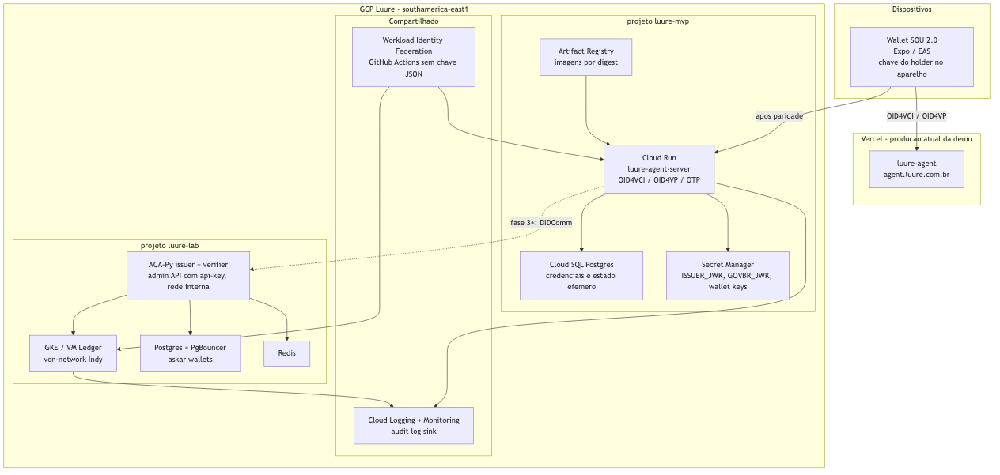

# Migração para a conta GCP da Luure — estado atual e plano seguro

**Público:** Tex, Klyff, Alex, Fagner
**Data:** 2026-09-16
**Escopo:** levar o ledger (Hyperledger Indy / ACA-Py) e os serviços novos desta semana
para a conta GCP da Luure, sem derrubar a demo que já está no ar.

---

## 1. Aviso de acesso (leia antes de planejar tarefa)

A conta GCP da Luure **ainda não está acessível** pelo CLI desta máquina. O `gcloud`
local está autenticado em `klyff@predix.global`, projeto `starlit-torus-492916-d7`
(`predix-dev-env`), e nenhum projeto Luure aparece em `gcloud projects list`.

Consequência prática: **nada foi verificado dentro da conta nova**. Tudo abaixo
descreve o que já roda hoje (Vercel, Docker local, EAS) e o que planejamos criar lá.
Primeiro item do kickoff é liberar IAM para o time e reautenticar o CLI.

---

## 2. O que já rodamos — inventário verificado

### 2.1 Agent OID4VC — em produção na Vercel

| Item | Valor |
|---|---|
| Domínio | `agent.luure.com.br` |
| Projeto Vercel | `luure-agent` (org LUURE TEHNOLOOGIA) |
| Runtime | Fastify em função serverless (`api/index.ts`), preset Fastify |
| Banco | Postgres gerenciado via `DATABASE_URL` (Prisma) |
| Chaves | `ISSUER_JWK` / `GOVBR_JWK` por env var; arquivos em `keys/` só no dev local |
| Portal demo | estático em `web/`, servido em `/portal` |
| Aliases legados | `agent.sovereignid.cloud` (308), `sovereignid-agent.vercel.app` |

Fluxos no ar: mock IdP gov.br (OIDC + PKCE), Issuer OID4VCI (pre-authorized code),
Verifier OID4VP (`direct_post`), status list de revogação e endpoint admin de revoke.

### 2.2 Ledger / blockchain — só Docker local

Repo [`luure-ledger`](https://github.com/klyff/luure-ledger),
compose `sp-identity-trust` em `mvp/luure-ledger/docker-compose.yml`:

- `von-network` (Indy, ledger de laboratório com genesis próprio) — UI em `:9000`, nós `9701-9708`
- `aca-py-issuer` (`:8000` DIDComm, `:8001` admin) e `aca-py-verifier` (`:8010` / `:8011`)
- `postgres:16` + `pgbouncer` (wallets askar, `MultiWalletSingleTable`)
- `redis:7` e `webhook-handler` (`:3002`)
- bootstrap por `setup.py` / `bootstrap.py` (schemas, cred defs, revocation registry)

Nunca subiu em nuvem. IaC já existe e é o ponto de partida:
`iac/luure-infra/providers/gcp/` com `terraform-vm/`, `ledger-vm/`, `cloudrun/`,
`nginx/` e charts Helm de `von-network`, `aca-py-issuer`, `aca-py-verifier`,
`postgres`, `redis` e `api-gateway`. Região default `southamerica-east1`.

### 2.3 Wallet SOU 2.0 — Expo / EAS

Expo SDK 57, chave do holder em `expo-secure-store`, sem conta na nuvem com dados
da carteira. Distribuição por Expo Go e EAS `preview`.

---

## 3. Componentes novos (o que entrou agora)

### 3.1 Login por OTP no agent — `src/modules/otp-auth/routes.ts`

Caminho alternativo ao gov.br mock, registrado em `app.ts`.

- `POST /auth/otp/request` — valida CPF de 11 dígitos contra o seed, gera código de
  6 dígitos com `crypto.randomInt`, TTL 5 min
- `POST /auth/otp/verify` — máximo 5 tentativas, invalida o código no acerto
- Estado guardado via `ephemeralSet` (tabela `EphemeralEntry` no Postgres), porque
  em serverless cada request pode cair em outra instância

**Ponto de atenção:** a resposta de `request` devolve `dev_code` em claro. É
laboratório sem SMS. Antes de qualquer ambiente compartilhado isso precisa de flag
(`OTP_EXPOSE_DEV_CODE`) desligada por padrão.

### 3.2 Segurança local na wallet

| Arquivo | Função |
|---|---|
| `src/services/local-auth.ts` | Face ID / Touch ID / senha do aparelho; `authenticateForShare` e `authenticateForAppUnlock`; bypass só em `__DEV__` |
| `src/services/security-prefs.ts` | prefs em SecureStore: `requireLockOnOpen`, `requireBiometricOnShare`, `biometricsEnabled` |
| `src/services/post-auth.ts` | roteamento pós-login |
| `src/app/login-otp.tsx` | login por código |
| `src/app/wallet-created.tsx` | cria/confirma a chave do holder no aparelho |
| `src/app/enroll-biometrics.tsx` | opt-in de biometria |
| `src/app/account-value.tsx` | tela de valor ("por que entrar") |

### 3.3 Rebrand Luure concluído

VCTs migrados para `urn:luure:sp:funcional` e `urn:luure:sp:margem-consignavel`,
scheme `luure://` registrado na wallet, pacote renomeado para `luure-agent-server`,
portal como "Luure - SOU 2.0". Já em produção.

| Repo | Commit |
|---|---|
| [luure-agent](https://github.com/klyff/luure-agent) | `2a2bb45` |
| [luure-agent-server](https://github.com/luure-sou2-sp/luure-agent-server) | `68b706c` |
| [luure-wallet-reactnative](https://github.com/luure-sou2-sp/luure-wallet-reactnative) | `72f48ee` |

Mantidos de propósito: host `agent.sovereignid.cloud` e scheme `sovereignid://`
(redirects antigos ainda em uso).

---

## 4. Riscos que não podem viajar para a nuvem como estão

Estes são defaults de laboratório. Cada um tem correção obrigatória antes do deploy.

| # | Risco hoje | Correção antes do GCP |
|---|---|---|
| R1 | ACA-Py sobe com `--admin-insecure-mode` (admin API sem autenticação) | `--admin-api-key` via Secret Manager + Ingress interno, nunca IP público |
| R2 | Senha de Postgres default no compose (`sp_identity_dev_password`) | senha gerada, Secret Manager, Cloud SQL sem IP público |
| R3 | OTP devolve `dev_code` na resposta | flag desligada fora do lab |
| R4 | `ALLOW_EXPO_REDIRECT=1` amplia a allowlist de redirect (`exp://`) | ligado só em lab; build nativo usa scheme fixo |
| R5 | `von-network:latest` sem pin | imagem por digest no Artifact Registry |
| R6 | Chaves do issuer como JWK em env var | Secret Manager com rotação; Cloud KMS/HSM na fase de produção |
| R7 | von-network é ledger de laboratório | não promover a produção; ledger de produção é decisão separada |

Regra geral: só dados do seed de demonstração. Nenhum dado real de servidor
público entra em ambiente GCP nesta fase.

---

## 5. Arquitetura alvo

Fonte do diagrama: [`gcp-target.mmd`](gcp-target.mmd).

---

## 6. Plano seguro, por fases

A demo continua na Vercel até haver paridade. Cutover de DNS é o último passo.

### Fase 0 — Landing zone e acesso (sem workload)

- Estrutura de projetos: `luure-lab`, `luure-mvp`, `luure-prod`, billing vinculado
- IAM por grupo para Tex, Klyff, Alex e Fagner; nada de permissão em usuário solto
- Org policies: bloquear criação de chave de service account, exigir OS Login,
  proibir IP público em VM, uniform bucket-level access
- Estado do Terraform em bucket GCS com versioning e acesso restrito
- Workload Identity Federation para GitHub Actions (deploy sem chave JSON)
- Audit logs habilitados com sink central

### Fase 1 — Rede e segredos

- VPC própria em `southamerica-east1` (não usar a `default`), Cloud NAT para saída
- Secret Manager: `ISSUER_JWK`, `GOVBR_JWK`, `ISSUER_WALLET_KEY`,
  `VERIFIER_WALLET_KEY`, credenciais de banco
- Artifact Registry privado, imagens pinadas por digest

### Fase 2 — Ledger no `luure-lab`

- Subir os charts que já existem (`von-network`, ACA-Py issuer/verifier, postgres,
  pgbouncer, redis) com admin API protegida por key e exposição só interna
- Disco PD-SSD com snapshot agendado; backup do Postgres das wallets askar
- Rodar `setup.py` e validar schemas, cred defs e registro de revogação
- Critério de saída: emissão e verificação DIDComm ponta a ponta no lab

### Fase 3 — Serviços de hoje no `luure-mvp`

- `luure-agent-server` em Cloud Run, Cloud SQL Postgres, segredos do Secret Manager
- Flags: `dev_code` do OTP desligado, `ALLOW_EXPO_REDIRECT` desligado
- Portal de demonstração atrás de Cloud Armor
- Vercel permanece servindo `agent.luure.com.br` durante toda a fase

### Fase 4 — Observabilidade, custo e rollback

- Cloud Logging/Monitoring com alertas de erro e latência
- Budget alerts por projeto
- Runbook de rollback: reverter DNS para a Vercel, que segue publicada

### Fase 5 — Cutover e descomissionamento

- Cutover de DNS só após paridade funcional comprovada
- Depois do cutover, avaliar o fim dos aliases `sovereignid` (host e scheme)

---

## 7. Frentes de trabalho

Os donos serão atribuídos no kickoff, quando o IAM da conta nova estiver liberado.

| Frente | Conteúdo |
|---|---|
| Landing zone | projetos, IAM, org policies, Terraform state, WIF |
| Ledger | GKE/VM, charts ACA-Py e von-network, backup, bootstrap |
| Serviços | Cloud Run, Cloud SQL, Secret Manager, flags de segurança |
| Wallet | apontamento de ambiente, builds EAS, validação em aparelho |
| Observabilidade | logs, alertas, budget, runbook |

---

## 8. Próximos três passos

1. Liberar IAM na conta GCP da Luure para o time e reautenticar o `gcloud` local
2. Criar `luure-lab` com as org policies da Fase 0 e o bucket de estado do Terraform
3. Subir o ledger no lab a partir de `providers/gcp/` com as correções R1, R2 e R5
